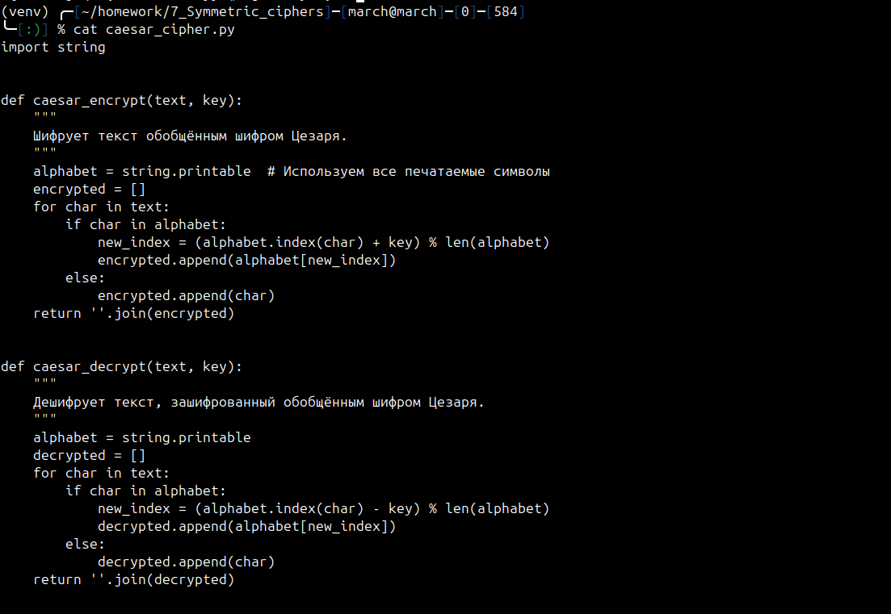

# Отчет по работе "Symmetric Ciphers"

## Основное задание

1. Написать функцию шифрования и дешифрования текста обобщенным шифром Цезаря.
2. Написать функцию, принимающую шифротекст, зашифрованный шифром из предыдущего задания и восстанавливающий текст, без знания ключа.
3. Реализовать в виде функций шифр Вернама.
## Ход выполнения работы

Создан тестовый файл `text.txt`. Все функции будут тестироваться с его использованием.

Создан файл `caesar_cipher.py`, который шифрует и дешифрует текст обобщенным шифром Цезаря.

Программа записывает зашифрованный текст в файл, а текст в этом файле расшифровывает и сохраняет еще в одном файле:

`caesar_crack.py`

Код расшифровывает файл с зашифрованным прошлой программой текстом.

`vernam_cipher.py`

Программа записывает зашифрованный текст в файл, а текст в этом файле расшифровывает и сохраняет еще в одном файле:

### Контрольные вопросы

1. **В чем заключается алгоритм частотного анализа?** 
	 Частотный анализ основывается на подсчете частоты символов в зашифрованном тексте. Злоумышленник сравнивает их с частотами букв в естественном языке (например, в английском чаще всего встречаются `e`, `t`, `a`) и подбирает ключ шифрования.
    
2. **Какие есть другие распространенные атаки на криптографические алгоритмы?**
    
    - **Перебор ключей (Brute force):** Полный перебор всех возможных ключей.
    - **Известный открытый текст (Known-plaintext attack):** Использование известного открытого текста и соответствующего шифротекста.
    - **Известный шифротекст (Ciphertext-only attack):** Анализ только зашифрованных данных.
    - **Атака по времени (Timing attack):** Анализ времени, требуемого для выполнения операций.
    
3. **Какие симметричные шифры используются в настоящее время и считаются надежными?**
    - **AES (Advanced Encryption Standard):** Самый популярный симметричный шифр.
    - **ChaCha20:** Быстрее AES в некоторых сценариях, используется в современных протоколах.
    - **Blowfish и его улучшенная версия Twofish.**
